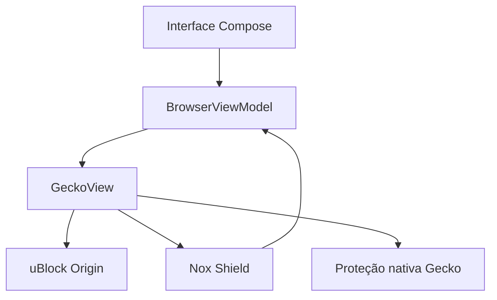

# Arquitetura

## Camadas

- `ui`: barra compacta, escudo, configurações, boas-vindas e visual GeckoView.
- `browser`: ciclo de vida do GeckoRuntime/GeckoSession, navegação segura, tela cheia, extensões e limpeza de dados.
- `data`: preferências locais sem banco externo.
- `scripts/fetch-ublock.sh`: baixa e valida o pacote oficial do uBlock Origin; o Gradle o extrai durante a build.
- `extensions/noxshield`: filtro complementar, limpeza visual e integração de estatísticas com a interface nativa.

O uBlock Origin é a defesa principal. O Nox Shield atua como segunda camada e também cobre elementos visuais ou controles do player que sobrevivam a mudanças pontuais do site.
